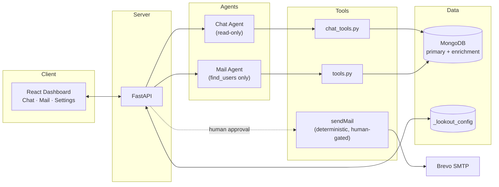
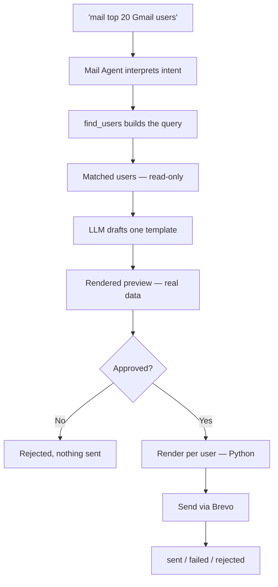
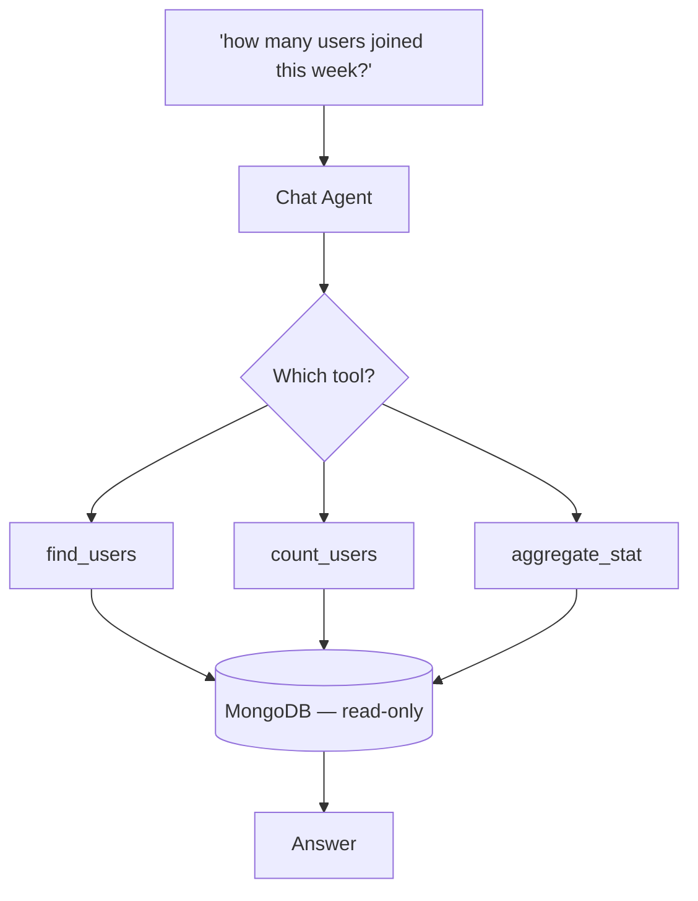

<div align="center">

# 🔭 LookOut

**An AI agent for your database. It investigates. It drafts. You decide what ships.**


[Quick Start](#quick-start) · [Architecture](#architecture) · [How It Works](#how-it-works) · [Design Decisions](#design-decisions)

</div>

<br/>

## Why I Built This

I wanted to thank SoulSync's most engaged listeners. The actual process: export users from MongoDB, paste them into an LLM and ask for the top listeners, ask for a personalized email per person, then copy each draft into my email service by hand.

The campaign worked. The workflow didn't. I wasn't making decisions anymore — I was just the wire between three systems that each already knew their job: the database had the users, the LLM knew how to write, the email service knew how to send. The only slow part was me, passing data between them by hand.

That's LookOut: one prompt, instead of four tools and a lot of copy-pasting.

<br/>

## Overview

LookOut is an AI agent that lives on top of your MongoDB cluster. Tell it how your collections relate, then just talk to it — ask a question and it investigates, describe a campaign and it drafts one.

No SQL. No hand-written aggregation pipelines. No copy-pasting between an LLM and your inbox.

Under the hood, it's not one agent doing everything — it's two specialists. One only ever reads. One only ever drafts. Neither one sends anything without you.

<br/>

## Architecture

A multi-agent system, cleanly layered: a React dashboard, a thin FastAPI layer, two specialized agents, and the systems they're allowed to touch.



The Chat Agent and Mail Agent are never the same process, and neither is ever handed `sendMail` directly. Sending is deterministic backend code, triggered only after a human approves.

<br/>

## How It Works

**Mail Agent** — hand it a goal in plain English. It investigates who matches, drafts one campaign, and waits for your yes before anything moves further:



Everything left of the approval step is a single LLM call. Everything right of it is Python — no further model involvement, which is why reviewing one preview is enough to trust all of them.

**Chat Agent** — same investigate-first pattern, opposite ceiling: there's no path out of this diagram toward anything that writes or sends.



<br/>

## Safety Model

The easy version of this product is one agent that does everything, including hitting send. That's not what shipped, on purpose.

- **Two agents, not one.** The agent that investigates and the agent that drafts campaigns never share a process, let alone a toolset — a multi-agent system by design, not one model wearing two hats.
- **Ranking is math, not judgment.** No model decides who's worth emailing — a plain aggregation pipeline sorts and filters, full stop.
- **The agent drafts. You ship.** Every campaign stops at a real, fully-rendered preview — never a template with `{name}` still in it — until a human says go.
- **Guesses stay guesses until confirmed.** Auto-suggested field mappings and join keys are shown against a real sample record. Nothing saves until a human says yes.
- **The Chat Agent physically can't send anything.** Not a rule it follows — a tool it was never given.

<br/>

## Design Decisions

**Why not LangChain's MongoDB agent toolkit?**

LangChain ships `MongoDBDatabaseToolkit` — schema discovery, query generation, and execution as ready-made tools, so an agent can, in principle, write its own aggregation pipeline from a natural-language question with no configuration at all. Two things ruled it out after testing it against a real dataset:

- **Token cost that scales with your schema, not with the question.** A general-purpose query-writing agent has to reason about collection structure before it can write anything — the more collections and fields you have, the more context every single query carries. LookOut's setup wizard resolves field mappings once, with a human confirming them, so a live query is one small, pre-scoped tool call instead of a discovery-then-generate-then-check loop repeated every time.
- **It got worse, not better, on real data.** In testing, free-form query generation misread schema and produced wrong results on prompts a narrow, pre-mapped tool handles correctly by construction — because that tool was never guessing what your fields mean in the first place.

The tradeoff: confirm your field mappings once, at setup. Every query afterward is cheap, fast, and can't misread your schema — because it was never asked to read it in real time.

**Why two agents instead of one flexible one?**

A single agent holding both `find_users` and `sendMail` is fewer moving parts to build, and a real risk the moment it misreads a prompt. Splitting investigation and drafting into separate agents with separate toolsets means the drafting agent is structurally incapable of sending, and the Chat Agent is structurally incapable of writing anything at all — neither guarantee depends on the model behaving; it depends on what tools exist.

**Why one template, rendered per user — not one draft per user?**

Nobody reviews 160 individually-written emails before approving a send. Generating a fresh draft per recipient also means every single one is a fresh chance for the model to drift in tone or invent a detail that wasn't in the source data. LookOut generates exactly one template, previews it fully rendered against one real user, then substitutes data for every other recipient in plain Python — no further model calls. Approving one preview is a real guarantee about all of them, because nothing after that point gets generated again.

**Why is ranking deterministic instead of asking the model who's "top"?**

Sorting isn't a task that benefits from a language model's judgment — it's arithmetic. Every ranking runs through a plain aggregation pipeline on the raw underlying value before anything is rounded for display. The model never sees the ranking step; it only ever sees the result.

**Why confirm field mappings and joins instead of inferring them silently?**

An automatic guess about which field joins two collections is either right, or it's a quiet failure — someone gets an email built from someone else's activity data, and nothing about that looks broken until a person notices. LookOut always shows the guess against a real sample record and waits for a confirmation click before saving it. The cost is one click; the alternative is a class of bug that doesn't announce itself.

<br/>

## Features

- **A multi-agent system** — an investigating agent and a drafting agent, never the same process
- **Bring your own database** — any MongoDB cluster, any schema, chosen at setup
- **Multi-collection joins** — one-to-one and one-to-many, resolved without duplicate rows
- **Live setup wizard** — auto-suggested field mapping, instant join validation against a real record
- **Hybrid config sync** — local `settings.json` plus MongoDB-backed durability
- **Scope-guarded chat** — off-topic questions get redirected back to your data, not answered

<br/>

## Quick Start

**Prerequisites:** Python 3.12+, Node.js 18+, [uv](https://github.com/astral-sh/uv)

**1. Clone and install**

```bash
git clone https://github.com/itslokeshx/Lookout.git
cd Lookout
uv sync && source .venv/bin/activate
cd frontend && npm install && cd ..
```

**2. Configure**

```bash
cp .env.example .env
```

```
GROQ_API_KEY=...       # Primary Groq API Key
GROQ_API_KEY_2=...     # Secondary fallback key (optional)
GROQ_API_KEY_3=...     # Tertiary fallback key (optional)
BREVO_API_KEY=...      # app.brevo.com → SMTP & API
MONGODB_URI=...        # your Atlas connection string
```

Lookout automatically handles fallback between up to 3 Groq API keys (e.g. if the primary key hits a rate limit or token limit, it transparently retries using the second and third keys). This allows you to easily scale past free tier limitations by providing up to three free keys.

Similarly, if you hit Brevo's daily free sending limit, you can update your `BREVO_API_KEY` in the `.env` file to another free account key and restart the server to resume sending.

**3. Run**

```bash
.venv/bin/uvicorn backend.server:app --reload --port 8000   # terminal 1
cd frontend && npm run dev                                    # terminal 2
```

Open `http://localhost:5173` — the setup wizard runs automatically on first launch and walks you through connecting your database.

<br/>

## Benchmarks

Tested against a real SoulSync production dataset — 101 Gmail users, one campaign prompt.

| Metric | Result |
|---|---|
| Users matched | 101 |
| Dispatch time | 94.75s (~0.93s/email) |
| Failed sends | 0 |
| Writes during targeting | 0 |

<br/>

<details>
<summary><b>Project structure</b></summary>
<br/>

```
Lookout/
├── agent/
│   ├── core.py            # Mail agent — exposes find_users only
│   ├── chat_agent.py       # Chat agent — read-only tools + scope guardrails
│   ├── chat_tools.py       # find_users, count_users, aggregate_stat
│   ├── tools.py             # Pipeline builder + sendMail (Brevo)
│   ├── cli.py                # Terminal orchestrator
│   ├── config.py              # Environment variable loader
│   ├── config_store.py         # settings.json + MongoDB (_lookout_config) sync
│   ├── campaign/
│   │   ├── drafting.py            # Template generation, SafeDict rendering
│   │   └── models.py               # EmailTemplate, EmailDraft, DispatchedResult
│   ├── db/client.py                 # PyMongo client, collection resolution
│   └── ui/cli.py                     # Terminal styling
│
├── frontend/    # React dashboard (Vite + Tailwind v4)
├── backend/     # FastAPI REST layer
├── settings.json
├── pyproject.toml
└── .env
```

</details>

<details>
<summary><b>Codebase reference</b></summary>
<br/>

**`agent/core.py`** — Builds the Mail agent on Groq via LangChain. Exposes exactly one tool, `find_users`, which queries matched users, safely serializes MongoDB documents, and caches results for the rest of the campaign flow.

**`agent/chat_agent.py`** — The conversational analyst. Read-only tools only, plus scope guardrails that keep responses database-centric and redirect off-topic questions.

**`agent/chat_tools.py`** — `chat_find_users`, `count_users`, `aggregate_stat`, `find_secondary_documents`, `count_secondary_documents`.

**`agent/tools.py`** — The aggregation pipeline builder behind `find_users`, the `sendMail` Brevo dispatcher, and an in-memory query cache shared across the wizard's steps.

**`agent/config_store.py`** — Hybrid persistence: writes to `settings.json`, syncs to `_lookout_config` in MongoDB, loads from either on startup. Also runs connection tests, join checks, and heuristic field-mapping suggestions.

**`agent/campaign/drafting.py`** — Wraps generated copy in an HTML shell and applies `SafeDict` substitution, so a missing field renders as literal placeholder text instead of raising an error.

**`agent/campaign/models.py`** — Pydantic v2: `EmailTemplate`, `EmailDraft`, `DispatchedResult`.

**`backend/server.py`** — FastAPI bridge:

| Endpoint | Purpose |
|---|---|
| `/api/settings` | Save / fetch configuration |
| `/api/databases`, `/api/collections/{db}` | Discover databases and collections |
| `/api/check-join` | Validate a primary/secondary key relationship |
| `/api/suggest-mapping` | Heuristic field-mapping suggestions |
| `/api/chat` | Message the Chat Agent |
| `/api/campaign/target` \| `/draft` \| `/dispatch` | Targeting, drafting, and dispatch steps |

**`frontend/src/App.jsx`** — View switching (setup vs. workspace), mode switching (Chat / Mail / Settings), theme persistence.

**`frontend/src/components/SetupView.jsx`** — Stepped onboarding with live schema preview.

**`frontend/src/components/ChatView.jsx`** / **`MailView.jsx`** — The two mode interfaces.

</details>

<details>
<summary><b>Database join strategy</b></summary>
<br/>

Plain `$lookup` + `$unwind` duplicates a user's row once per matching secondary document — a real problem the moment a relationship is one-to-many. LookOut uses a correlated sub-pipeline that sorts and limits *inside* the lookup, resolving to exactly one enrichment record per user before it reaches the result set:

```python
lookup_pipeline = [
    {"$match": {"$expr": {"$eq": [f"${foreign_key}", "$$local_val"]}}}
]
if sort_field:
    sort_dir = -1 if not sort_ascending else 1
    lookup_pipeline.append({"$sort": {sort_field: sort_dir}})
lookup_pipeline.append({"$limit": 1})  # collapses one-to-many into one record

pipeline.append({
    "$lookup": {
        "from": secondary_collection,
        "let": {"local_val": f"${local_key}"},
        "pipeline": lookup_pipeline,
        "as": "_enrichment_docs"
    }
})
```

No duplicate rows, no silent data loss — the sort/limit behavior is explicit and configurable per relationship, not an accidental side effect of how Mongo expands an array.

</details>

<details>
<summary><b>Setup wizard walkthrough</b></summary>
<br/>

**1. Database & join configuration** — pick one collection or two. For two, map the local key (usually `_id`) to the foreign key, then run **Check Relationship Validation** — LookOut queries a real sample record and reports exactly how many matches it found.

**2. Field mapping** — map email/name (or click **Auto-suggest**), optionally join-date and last-active, and any numeric metrics worth aggregating. A live schema preview shows the exact JSON structure being queried as you go.

**3. Sender configuration** — set the name and address recipients see. Saving syncs to both `settings.json` and `_lookout_config`.

</details>

<br/>

## Contributing

```bash
git checkout -b feature/amazing-feature
git commit -m "Add some amazing feature"
git push origin feature/amazing-feature
```

Open a pull request, or file an issue if something's broken.

## License

MIT — see [LICENSE](./LICENSE).