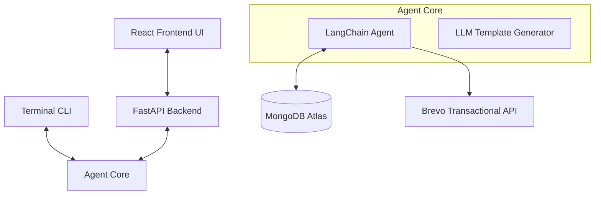

<div align="center">

# 🔭 LOOKOUT

### AI-Agentic Email Campaign Dispatch Engine

*State your campaign goals in plain English. Let the discovery and drafting agents do the work.*


</div>

---

## 🚀 Overview

**Lookout** is a conversational email dispatch orchestrator built for the **SoulSync** streaming platform. Using conversational inputs, it automates the entire marketing lifecycle: user targeting, content personalization, review previews, and SMTP delivery.

Instead of writing SQL queries, building custom MongoDB aggregation pipelines, or designing HTML emails, you describe your target audience and intent directly in natural language:

> *"mail to the users 3 their names is alice,bob,charlie as welcome to soulsync"*

The new **Lookout Dashboard** provides a beautiful, dark-themed React UI to manage this process visually, while maintaining the powerful, lightning-fast Python CLI for terminal power users.

---

## 🛠️ Architecture

Lookout is built with a clean, decoupled architecture:



1. **Natural Language Discovery**: The user's prompt is processed by the **Discovery Agent** (`agent/core.py`). It dynamically infers filters, sorting rules, and query limits.
2. **Structured Template Generation**: The **Drafting Agent** generates an email template (`EmailTemplate`) with strict Pydantic formatting. The subject line and HTML body are tailored with dynamic placeholders based *only* on fields available in the matched records.
3. **Approval Gate & Dispatch Loop**: The UI (or CLI) renders a complete markdown-styled preview before sending. Once human validation is given, individual HTML emails are rendered and dispatched via Brevo.

---

## 📂 Project Structure

```text
Lookout/
├── frontend/             # The complete React + Vite application
│   ├── src/              # React components, Tailwind CSS v4, API hooks
│   └── package.json
│
├── backend/              # The FastAPI server
│   └── server.py         # HTTP bridge for the frontend UI
│
├── agent/                # The Core AI Logic & Database Tools
│   ├── campaign/         # Email drafting, rendering, and Pydantic models
│   ├── db/               # MongoDB client configuration
│   ├── ui/               # Command-line interface aesthetics
│   ├── core.py           # LangChain Groq agent & prompts
│   ├── tools.py          # Brevo dispatch & MongoDB discovery tools
│   ├── cli.py            # Terminal app entrypoint
│   └── config.py         # Secrets and environment config
│
├── pyproject.toml        # Python dependencies
└── .env                  # Environment variables
```

---

## 💻 Tech Stack

**Frontend:**
- React (Vite)
- Tailwind CSS v4
- Lucide Icons

**Backend & AI Core:**
- FastAPI (REST API)
- LangChain (Agent Orchestration)
- Groq (`openai/gpt-oss-120b`)
- Pydantic v2 (Data Validation)
- MongoDB Atlas (via PyMongo)
- Brevo API (Transactional Delivery)

---

## ⚙️ Setup and Installation

### 1. Clone the repository
```bash
git clone https://github.com/itslokeshx/Lookout.git
cd Lookout
```

### 2. Configure Python & API Keys
```bash
# Install dependencies
uv sync
source .venv/bin/activate

# Setup environment variables
cp .env.example .env
```
Populate `.env` with your active API keys:
```env
GROQ_API_KEY=gsk_your_groq_key
BREVO_API_KEY=xkeysib-your_brevo_key
MONGODB_URI=mongodb+srv://your_connection_string
```

### 3. Setup Frontend
```bash
cd frontend
npm install
cd ..
```

---

## 🏃 Running Lookout

Lookout can be run using the beautiful Web Dashboard or the lightning-fast CLI.

### Option A: The Web Dashboard (Recommended)

You need to run both the API and the Frontend. Open two terminal tabs:

**Terminal 1 (Backend API):**
```bash
# From the project root
.venv/bin/uvicorn backend.server:app --reload --port 8000
```

**Terminal 2 (React Frontend):**
```bash
# From the frontend directory
cd frontend
npm run dev
```
Then visit `http://localhost:5173` in your browser.

### Option B: The Terminal CLI

If you prefer to work entirely in the terminal:
```bash
# From the project root
.venv/bin/python -m agent.cli
```

---

## 📊 Database Schema Fields

The agent is trained to filter, rank, and query users dynamically utilizing these document schema fields:

| Field | Type | Description |
|---|---|---|
| `name` | String | User's full display name |
| `email` | String | User's email address |
| `totalListeningTime` | Number (seconds) | Total streaming duration |
| `createdAt` | ISO DateTime | Account creation timestamp |
| `updatedAt` | ISO DateTime | Last active session timestamp |

---

## 📄 License

Lookout is open-source software licensed under the [MIT License](LICENSE).
