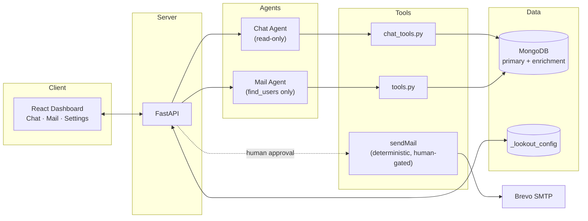
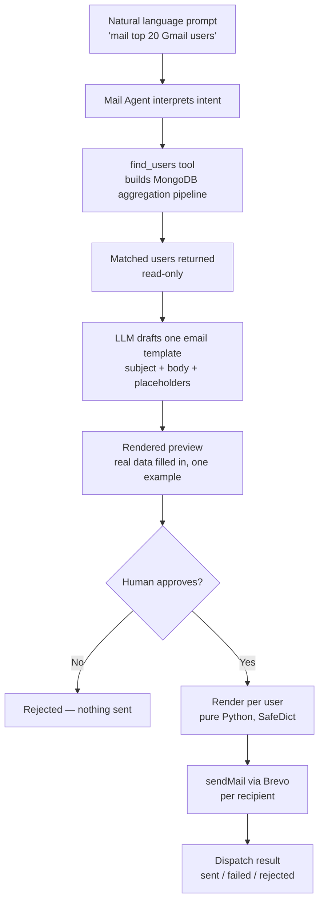
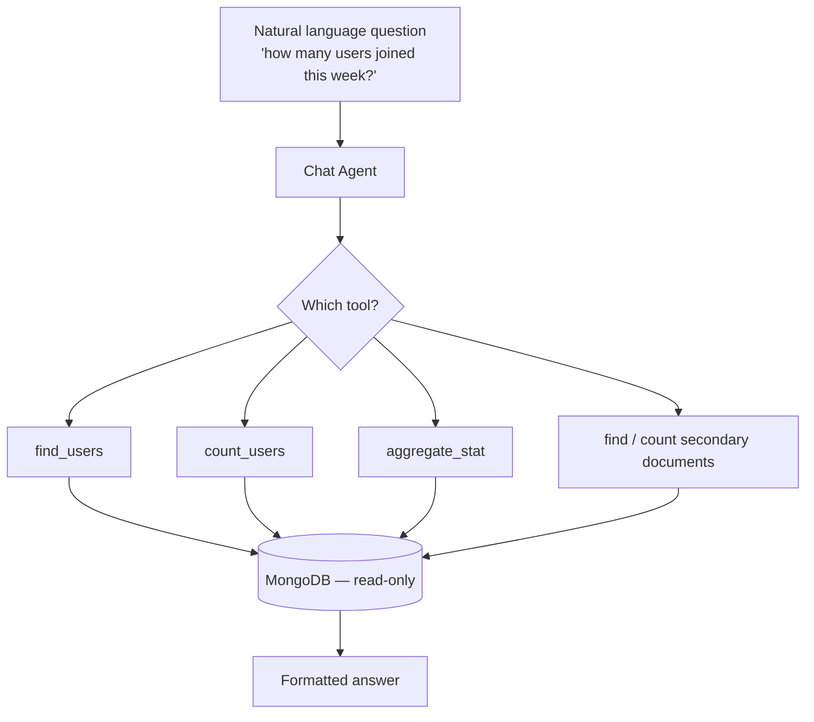

# 🔭 LookOut

**The Autonomous AI Agent for Multi-Collection Database Analytics & Campaigns**


> "LookOut started because I was tired of being the human bridge between my database, an LLM, and my email provider. Today, that bridge is a single prompt."

An intelligent, multi-collection database agent that answers analytical questions in plain English and orchestrates targeted email campaigns — with every dispatch gated behind explicit human approval.

---

## Table of Contents

- [The Story Behind LookOut](#-the-story-behind-lookout)
- [Overview](#-overview)
- [Architecture](#-architecture)
- [Execution Flow](#-execution-flow)
- [Features](#-features)
- [Project Structure](#-project-structure)
- [Codebase Reference](#-codebase-reference)
- [Database Join Strategy](#-database-join-strategy)
- [Setup & Installation](#-setup--installation)
- [Dashboard Onboarding & Setup Wizard](#-dashboard-onboarding--setup-wizard)
- [Dashboard Modes](#-dashboard-modes)
- [Benchmarks](#-benchmarks)
- [Safety & Design Principles](#-safety--design-principles)
- [Contributing](#-contributing)
- [License](#-license)

---

## 📖 The Story Behind LookOut

LookOut wasn't born because I wanted to build an AI agent. It was born because I got tired of doing the same manual workflow over and over again.

While working on SoulSync, I wanted to thank and reward my most engaged listeners. It sounded like a simple task, but the actual process quickly became tedious:

1. **Export** every user from MongoDB.
2. **Analyze** the export by hand-feeding it to an LLM and asking it to identify the top listeners.
3. **Draft** a personalized email for each one, one prompt at a time.
4. **Copy-paste** every generated email into my email service, one recipient at a time.

The campaign worked. The workflow didn't.

I wasn't making decisions anymore — I was just acting as the wire between three systems that each already knew their job: the database had the users, the LLM knew how to write the emails, and the email service knew how to deliver them. The only slow part was me, manually passing data between them.

That was the moment LookOut clicked: why not let an agent orchestrate the whole thing — discover the right users, draft personalized copy with clear reasoning, present it for approval, and dispatch only what's approved?

What used to take four tools and a lot of copy-pasting is now one natural-language prompt.

---

## 🚀 Overview

LookOut connects to any MongoDB database, lets you describe relationships between collections, and answers questions or runs campaigns entirely in plain English — no SQL, no hand-built aggregation pipelines, no manually assembled HTML emails.

```
"Count the users who signed up last week."
"List the messages sent by users on Gmail."
"Mail the top 5 users by listening time to announce our new feature."
```

LookOut operates in two distinct, structurally separated modes:

| Mode | Purpose | Can it send anything? |
|---|---|---|
| 💬 **Chat** | Ask natural-language questions about your users and metrics | **No — read-only, always** |
| ✉️ **Mail** | Describe an audience, review a generated draft, approve, dispatch | Only after explicit human approval |

Currently, MongoDB is the only supported database.

---

## 🏗️ Architecture

LookOut is split into four cleanly decoupled layers: a React dashboard, a thin FastAPI HTTP layer, two purpose-built agents with different tool access, and the data/delivery layer they're allowed to touch.



The key structural decision: **the Chat Agent and Mail Agent are never the same agent, and neither is ever given `sendMail` directly.** Sending is deterministic backend code, invoked only after a human clicks approve — not a capability either LLM holds.

---

## 🔁 Execution Flow

### Mail Mode — targeting to dispatch



Note the shape of this pipeline: everything left of the approval diamond is either deterministic code or a single LLM call producing **one** template. Everything right of it is pure substitution and delivery — no further LLM involvement, so the one preview a human reviews is representative of every email that goes out.

### Chat Mode — read-only, always



There is no arrow out of this diagram toward Brevo or any write operation — the Chat Agent's toolset physically does not include one.

---

## ✨ Features

- **Bring Your Own Database (BYODB)** — connect any MongoDB cluster and choose your collections dynamically. MongoDB is the only supported database at this time.
- **Dynamic multi-collection joins** — supports one-to-one and one-to-many relationships via a correlated `$lookup` sub-pipeline (see [Database Join Strategy](#-database-join-strategy)), avoiding row duplication on the one-to-many case.
- **Dual-collection querying** — dedicated tools let the agent query the primary collection, the secondary (enrichment) collection, or a joined view of both.
- **Interactive setup wizard** — live schema preview, auto-suggested field mapping, and instant join validation against a real sample record.
- **Hybrid local + cloud settings sync** — configuration is written to `settings.json` for instant local access and synced to MongoDB under `_lookout_config` for durability.
- **Premium monochrome interface** — high-contrast dark theme by default, with a light-mode toggle.
- **Scope guardrails** — the Chat Agent politely declines and redirects off-topic trivia or general-knowledge questions back to your database.

---

## 📂 Project Structure

```
Lookout/
├── agent/                    # Core AI engine
│   ├── core.py                # Mail-mode agent: LangChain + Groq, exposes find_users only
│   ├── chat_agent.py           # Chat-mode agent: read-only tools + scope guardrails
│   ├── chat_tools.py           # find_users, count_users, aggregate_stat, secondary-collection tools
│   ├── tools.py                 # Aggregation pipeline builder + sendMail (Brevo)
│   ├── cli.py                   # Standalone terminal orchestrator
│   ├── config.py                # Environment variable loader
│   ├── config_store.py          # Hybrid settings.json + MongoDB (_lookout_config) persistence
│   ├── campaign/
│   │   ├── drafting.py            # Template generation, HTML wrapper, SafeDict rendering
│   │   └── models.py               # Pydantic models: EmailTemplate, EmailDraft, DispatchedResult
│   ├── db/
│   │   └── client.py               # PyMongo client, primary/secondary collection resolution
│   └── ui/
│       └── cli.py                   # Terminal styling and spinners
│
├── frontend/                  # React dashboard (Vite + Tailwind v4)
├── backend/                   # FastAPI REST layer
├── settings.json               # Local settings backup (auto-created)
├── pyproject.toml               # Python dependencies
└── .env                          # API credentials and secrets (never committed)
```

---

## 🧠 Codebase Reference

**`agent/core.py`** — Builds the Mail-mode agent: configures the system prompt with the mapped database attributes and initializes a LangChain agent on Groq. Exposes exactly one tool, `find_users`, which queries matched users, safely serializes MongoDB documents, and caches results in memory for the rest of the campaign flow.

**`agent/chat_agent.py`** — Defines the conversational data analyst. Configures the model with read-only query tools only, and enforces scope guardrails that keep responses database-centric, politely redirecting trivia or unrelated questions.

**`agent/chat_tools.py`** — The Chat mode toolset:
- `chat_find_users` — user lookup with dynamic join mapping
- `count_users` — counts matching a filter
- `aggregate_stat` — avg / sum / min / max over a numeric field
- `find_secondary_documents` / `count_secondary_documents` — direct inspection of the enrichment collection

**`agent/tools.py`** — Low-level implementation: the aggregation pipeline builder behind `find_users`, the `sendMail` Brevo dispatcher, and an in-memory query cache shared across the campaign wizard's steps.

**`agent/config_store.py`** — Hybrid persistence: writes to `settings.json` for instant local access, syncs to `_lookout_config` in MongoDB, and loads from either source on startup. Also implements connection testing, join relationship checks, and heuristic field-mapping suggestions.

**`agent/campaign/drafting.py`** — Wraps generated copy in a responsive HTML email shell and applies `SafeDict` substitution so a missing user attribute never raises an error — it leaves the literal placeholder instead of crashing the render.

**`agent/campaign/models.py`** — Strict Pydantic v2 schemas: `EmailTemplate`, `EmailDraft`, `DispatchedResult`.

**`agent/db/client.py`** — Lazily initializes the MongoDB client and resolves primary/secondary collection handles.

**`backend/server.py`** — The FastAPI bridge between the dashboard and the agent layer:

| Endpoint | Purpose |
|---|---|
| `/api/settings` | Save and fetch setup configuration |
| `/api/databases`, `/api/collections/{db}` | Discover databases and collections |
| `/api/check-join` | Validate a primary/secondary key relationship |
| `/api/suggest-mapping` | Heuristic field-mapping suggestions |
| `/api/chat` | Send a message to the Chat Agent |
| `/api/campaign/target` | Run the targeting step |
| `/api/campaign/draft` | Generate the email template |
| `/api/campaign/dispatch` | Send approved emails, tracking live status |

**`frontend/src/App.jsx`** — Top-level state manager: view switching (setup vs. workspace), mode switching (Chat / Mail / Settings), and theme persistence.

**`frontend/src/components/SetupView.jsx`** — Stepped onboarding: database connection, field mapping with auto-suggest, join testing, SMTP configuration, with a live schema preview panel.

**`frontend/src/components/ChatView.jsx`** — The conversational interface: renders markdown, lists, and tables from agent responses.

**`frontend/src/components/MailView.jsx`** — The campaign orchestrator: targeting results, template editing, rendered HTML previews, and dispatch monitoring.

---

## 🔗 Database Join Strategy

Simple `$lookup` + `$unwind` duplicates a primary user's row once per matching secondary document — a problem the moment a relationship is one-to-many. LookOut instead uses a correlated sub-pipeline that sorts and limits *inside* the lookup, resolving the join to exactly one enrichment record per user before it ever reaches the result set:

```python
lookup_pipeline = [
    {"$match": {"$expr": {"$eq": [f"${foreign_key}", "$$local_val"]}}}
]
if sort_field:
    sort_dir = -1 if not sort_ascending else 1
    lookup_pipeline.append({"$sort": {sort_field: sort_dir}})
lookup_pipeline.append({"$limit": 1})  # collapses one-to-many into exactly one record

pipeline.append({
    "$lookup": {
        "from": secondary_collection,
        "let": {"local_val": f"${local_key}"},
        "pipeline": lookup_pipeline,
        "as": "_enrichment_docs"
    }
})
```

No duplicate rows, no silent data loss, and the sort/limit behavior is explicit and configurable per relationship — not an accidental side effect of how Mongo happens to expand an array.

---

## ⚙️ Setup & Installation

**Prerequisites:** Python 3.12+, Node.js 18+, [uv](https://github.com/astral-sh/uv)

```bash
git clone https://github.com/itslokeshx/Lookout.git
cd Lookout
```

**Python environment:**
```bash
uv sync
source .venv/bin/activate
```

**Environment variables:**
```bash
cp .env.example .env
```
```
GROQ_API_KEY=gsk_your_groq_api_key_here
BREVO_API_KEY=xkeysib-your_brevo_key_here
MONGODB_URI=mongodb+srv://<username>:<password>@cluster.mongodb.net/
```

> **Model recommendation (free tier):** `openai/gpt-oss-120b` for production quality, `llama-3.3-70b-versatile` as a faster/cheaper alternative.

**Frontend:**
```bash
cd frontend
npm install
cd ..
```

**Run it** (two terminals):
```bash
# Terminal 1 — API
.venv/bin/uvicorn backend.server:app --reload --port 8000

# Terminal 2 — Dashboard
cd frontend && npm run dev
```

Visit `http://localhost:5173`.

---

## 🧙 Dashboard Onboarding & Setup Wizard

**Step 1 — Database & Join Configuration**
Choose 1 collection (everything in one place) or 2 collections (join/enrichment). Select your database and primary collection from auto-discovered options. If using two collections, map the local key (usually `_id`) to the foreign key in your secondary collection, then click **Check Relationship Validation** — LookOut queries a real sample record and reports exactly how many matches it found, catching a bad mapping before it ever reaches a live campaign.

**Step 2 — Intelligent Field Mapping**
Map email and name fields (or click **Auto-suggest** to run a heuristic match over your schema), optionally map join-date and last-active fields, and project any numeric metrics you want the agent to aggregate. A live schema preview panel shows the exact JSON structure LookOut will query, updating as you go.

**Step 3 — Sender Configuration**
Set the sender name and address recipients will see. Saving compiles everything into `settings.json` and syncs it to `_lookout_config` in MongoDB, then unlocks the dashboard.

---

## 🎮 Dashboard Modes

**💬 Chat Mode** — A read-only playground for data exploration. Five query tools (`chat_find_users`, `count_users`, `aggregate_stat`, `find_secondary_documents`, `count_secondary_documents`) handle counts, statistics, filtering, and schema inspection. Scope guardrails redirect off-topic questions back to your data. Responses render as formatted tables, totals, and summaries.

**✉️ Mail Mode** — A four-stage wizard:
1. **Targeting** — describe your audience in plain English; the agent builds filters and returns a match count.
2. **Template generation** — the agent drafts one subject/body pair for the audience.
3. **Review & preview** — browse individual recipient cards showing the exact rendered HTML, placeholders already filled with real data.
4. **Dispatch** — sends via Brevo with a live progress bar, results saved to your local dispatch history.

---

## 📊 Benchmarks

Tested against a real production dataset from SoulSync.

**Campaign:** "Mail every Gmail user informing them that SoulSync Wrapper is now available."

| Metric | Result |
|---|---|
| Users matched | 101 |
| Total dispatch time | 94.75s (~0.93s/email) |
| Failed deliveries | 0 (100% SMTP acceptance) |
| Write operations during targeting | 0 |

**Environment:** MongoDB Atlas · GPT-OSS-120B (Cerebras) · Brevo Transactional Email API

---

## 🛡️ Safety & Design Principles

The single design decision this whole project is built around: **an LLM may propose, draft, or suggest — it never decides or executes anything that touches real data or sends anything, without a human in between.**

Concretely:

- **Ranking is deterministic.** Users are never selected by an LLM's judgment — a plain aggregation pipeline sorts and filters, with no model involved in *who* gets targeted.
- **Tool access is structurally scoped, not just prompted.** The Chat Agent's toolset contains no write or send capability at all — it is not instructed to avoid sending, it is incapable of it. The Mail Agent has exactly one tool, `find_users`; `sendMail` is never handed to any LLM-driven agent, ever.
- **Every dispatch requires a human decision.** No campaign reaches an inbox without an explicit approval step.
- **The preview is always real.** Approval happens against a rendered example with actual recipient data — never a raw template with unfilled placeholders — so what you approve is what gets sent.
- **Templates can't crash on missing data.** `SafeDict` substitution means an absent field renders as literal placeholder text instead of raising an error mid-campaign.
- **Field mappings and joins are always human-confirmed.** Auto-suggestions (from heuristics or an LLM) are exactly that — suggestions. Nothing is saved or queried against until a person reviews and confirms it, using a real sample record as evidence.

---

## 🤝 Contributing

LookOut is fully open-source and welcomes contributors of any experience level — bug fixes, prompt improvements, new database support, or additional email provider integrations.

```bash
# Fork, then:
git checkout -b feature/amazing-feature
git commit -m "Add some amazing feature"
git push origin feature/amazing-feature
# Open a pull request
```

Found a bug or have an idea? Open an issue.

---

## 📄 License

MIT — see [LICENSE](./LICENSE).