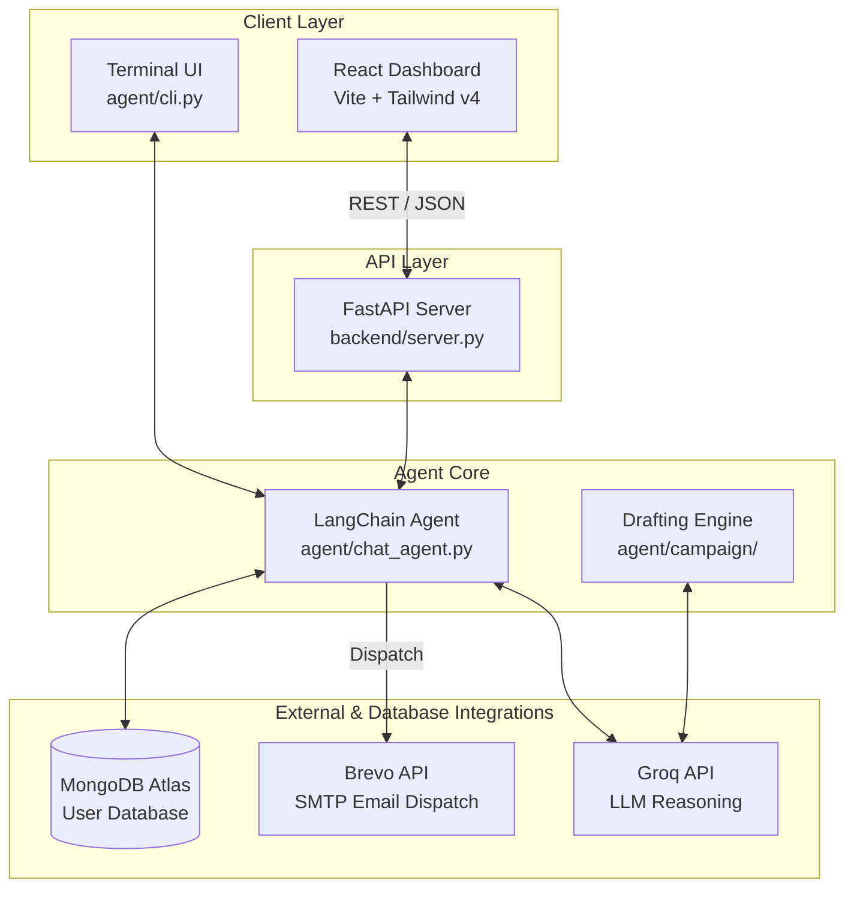

<div align="center">

# 🔭 LookOut

### The Autonomous AI Agent for Multi-Collection Database Analytics & Campaigns

*An intelligent, multi-collection database agent that answers analytical queries and autonomously orchestrates dynamic marketing campaigns.*

[](https://react.dev)
[](https://tailwindcss.com)
[](https://fastapi.tiangolo.com)
[](https://www.python.org)
[](https://langchain.com)
[](https://www.mongodb.com)
[](https://www.brevo.com)

</div>

---

## 🚀 Overview

**LookOut** is an autonomous AI agent system designed to interactively explore, query, and campaign over multi-collection databases. Built for founders, developers, and product teams, it allows you to connect *any* MongoDB database (currently, LookOut only supports MongoDB), specify relationships between collections, query records in plain English, and autonomously dispatch targeted HTML email campaigns.

Instead of writing SQL queries, building custom MongoDB aggregation pipelines, or designing HTML emails, you describe your target audience and intent directly in natural language:

> *"Count the total number of users who signed up last week."*  
> *"List the messages sent by users who are using Gmail."*  
> *"Mail the top 5 users by listenedTime to announce our new feature."*

LookOut operates in two distinct modes:
- **💬 Chat Mode (Database Analytics):** Ask natural-language questions about your users, collection metrics, or joined tables. LookOut automatically queries your database and displays summary counts, averages, and formatted records.
- **✉️ Mail Mode (Campaign Orchestration):** Describe your target audience in plain English, dynamically generate personalized email templates, preview the dynamic HTML rendered versions, and securely dispatch transactional email campaigns.

---

## ✨ Features

- **Bring Your Own Database (BYODB):** Connect any MongoDB cluster and choose collections dynamically (currently, LookOut exclusively supports MongoDB).
- **Dynamic Multi-Collection Joins:** 
  - Supports **one-to-one** and **one-to-many** relationships.
  - Employs a robust sub-pipeline `$lookup` (with sorting and `$limit: 1`) to eliminate row duplication issues while retaining enriched records.
- **Dual-Collection Agent Querying:** 
  - Dedicated tools allow the agent to query the primary collection (`userdetails`) and the secondary collection (`messages`) independently or joined.
- **Interactive Setup Wizard:** 
  - **Live Schema Preview:** Side-by-side JSON block updating dynamically as you map attributes.
  - **Auto-Suggest Mapping:** Automated heuristic mapping to configure key fields.
  - **Join Validation:** Instantly tests relationships and returns sample query results.
- **Robust Local & Cloud Sync:** 
  - Settings are preserved inside the workspace (`settings.json`) and synchronized to MongoDB (`_lookout_config`).
- **Premium Monochrome Interface:** 
  - Stunning pitch-black primary dark theme (`#000000`) with high-contrast text and interactive light mode toggle.
- **Scope & Abuse Control:** 
  - Prompt guardrails ensure the agent pivots trivia or general knowledge questions back to LookOut's analytical capabilities.

---

## 📐 System Design & Architecture

### System Topology



### Execution Pipeline

```mermaid
sequenceDiagram
    actor User
    participant App as Dashboard / CLI
    participant Agent as LangChain Agent
    participant DB as MongoDB
    participant LLM as Groq LLM
    participant Brevo as Brevo API

    User->>App: "List messages sent by active users"
    App->>Agent: Submit Prompt
    
    rect rgb(18, 18, 18)
        Note right of Agent: Phase 1: Database Query & Join
        Agent->>LLM: Parse intent and construct filters
        LLM-->>Agent: Query filters & join keys
        Agent->>DB: Execute Aggregation Lookup (sub-pipeline with limit 1)
        DB-->>Agent: De-duplicated & enriched documents
    end
    
    rect rgb(18, 18, 18)
        Note right of Agent: Phase 2: Response Composition
        Agent->>LLM: Synthesize raw data into readable markdown
        LLM-->>Agent: Structured analytical markdown response
        Agent-->>App: Display chat response & table preview
    end
```



---

## 📂 Project Structure

```text
Lookout/
├── agent/                    # 🧠 CORE AI ENGINE (Primary Logic)
│   ├── core.py               # ➔ LangChain core logic for campaign discovery
│   ├── chat_agent.py         # ➔ LangChain conversational analyst with prompt guardrails
│   ├── chat_tools.py         # ➔ Specialized query tools (user queries, secondary/enrichment collection access)
│   ├── tools.py              # ➔ Aggregation pipeline finders & Brevo SMTP integration
│   ├── cli.py                # ➔ Standalone terminal CLI orchestrator
│   ├── config.py             # ➔ Environment variables loader
│   ├── config_store.py       # ➔ Hybrid file-system and MongoDB persistence managers
│   ├── campaign/             
│   │   ├── drafting.py       # ➔ Campaign template generation & dynamic placeholder injection
│   │   └── models.py         # ➔ Strict Pydantic models (EmailTemplate, EmailDraft)
│   ├── db/                   
│   │   └── client.py         # ➔ PyMongo database clients
│   └── ui/                   
│       └── cli.py            # ➔ Terminal styling & spinner modules
│
├── frontend/                 # 💻 REACT DASHBOARD (Vite + Tailwind v4 + Light Mode)
├── backend/                  # 🔌 FASTAPI SERVER (Rest API Router)
├── settings.json             # 💾 Local settings backup store (Auto-created)
├── pyproject.toml            # 📦 Python project dependencies
└── .env                      # 🔑 API credentials and secrets
```

---

## ⚙️ Setup and Installation

Follow these steps to configure your environment and launch LookOut v2.

### Prerequisites
- Python 3.12+
- Node.js 18+
- [uv](https://github.com/astral-sh/uv) (Python dependency manager)

---

### Step 1: Clone and Initialize
```bash
git clone https://github.com/itslokeshx/Lookout.git
cd Lookout
```

### Step 2: Set Up Python Virtual Environment
Use `uv` to create a virtual environment and synchronize dependencies:
```bash
# Install virtual environment and dependencies
uv sync
source .venv/bin/activate
```

### Step 3: Configure Environment Variables
Create a `.env` file at the root of the project:
```bash
cp .env.example .env
```
Populate the variables:
```env
GROQ_API_KEY=gsk_your_groq_api_key_here
BREVO_API_KEY=xkeysib-your_brevo_key_here
MONGODB_URI=mongodb+srv://<username>:<password>@cluster.mongodb.net/
```

### Step 4: Install Frontend Dependencies
```bash
cd frontend
npm install
cd ..
```

---

## 🏃 Running LookOut

Open two terminals or background tabs to run the services concurrently:

### Terminal 1: Backend FastAPI Server
```bash
# Ensure you are at the project root and virtualenv is active
.venv/bin/uvicorn backend.server:app --reload --port 8000
```

### Terminal 2: React Vite Dashboard
```bash
cd frontend
npm run dev
```

Visit **`http://localhost:5173`** in your browser.

---

## 🛠️ Step-by-Step Dashboard Onboarding & Collection Mapping

When you open `http://localhost:5173` for the first time, you will be guided through a 3-step setup wizard to configure the agent's target database context:

### 1️⃣ Step 1: Database & Collection Join Configuration
Configure where the agent retrieves data and how collections relate:
* **Number of Collections:** Choose between **1 Collection** (if user details and activities are in a single place) or **2 Collections (Join / Enrichment)** (if you want the agent to enrich user records with dynamic metrics like messages, orders, or logs from a separate collection).
* **Database:** Select from the dropdown of auto-discovered databases found on your active MongoDB cluster.
* **Primary Collection (Users):** Select the collection that holds the core user records (typically containing `username`, `email`, etc.).
* **Secondary Collection (Enrichment):** *(Visible only if 2 Collections is selected)* Select the collection holding relational details to join.
* **Join Configuration (Key Mapping):**
  - **Local Key (primary):** The identifier field in your primary collection (usually `_id` or `username`).
  - **Foreign Key (secondary):** The key in the secondary collection that maps back to the primary collection's local key (e.g. `userId` or `username`).
* **Check Relationship Validation:** Click this button to test the join keys instantly. The system queries a sample record and attempts to resolve a matching document. It reports exactly how many matches were found for the test value (e.g. `one-to-one (1 matches for sample value)` or warnings if 0 matches exist), ensuring your mapping is correct.
* **Product Name:** Define your product's name (e.g., `Chatty` or `SoulSync`). This aligns the AI's agentic context and sets email template signatures.

### 2️⃣ Step 2: Intelligent Field Mapping
Configure which attributes represent identities, metrics, and additional context:
* **Email Field & Name Field:** Select the properties that represent the user's email address and display name. If you are unsure, click **Auto-suggest** to run a heuristic matching algorithm over your collection schema.
* **Join Date & Last Active Field:** (Optional) Map timestamps indicating when users joined and their last session activity.
* **Numeric Metrics:** Project numeric stats that the agent can aggregate (e.g. field `totalListeningTime`, Custom Label `Listened Time`, unit `sec`). The agent uses these mappings to dynamically compute `avg`, `sum`, `min`, or `max`.
* **Custom Extra Fields:** Input any additional schema fields you want the agent to query and view (e.g. `authProvider`, `role`, `status`, or attributes from your joined secondary collection like `text` or `count`).
* **Live Schema Preview:** As you define mappings, the side-panel displays the exact JSON structure that the LookOut agent queries, letting you verify configurations in real-time.

### 3️⃣ Step 3: Sender Configuration
Configure the SMTP sending identity used when dispatching campaigns:
* **Sender Name & Sender Email:** Define the default name and email address that recipients will see in campaign dispatches.
* **Save / Complete Setup:** Compiles the configuration, writes it to `settings.json`, syncs it to MongoDB Atlas under `_lookout_config` for cloud redundancy, and unlocks the Chat & Mail dashboards.

---

## 🎮 Dashboard Interface Modes

LookOut's dashboard features a dual-mode workflow switcher designed for both interactive exploration and structured workflow orchestration:

### 💬 Chat Mode: The Conversational Database Analyst
Chat Mode is a read-only playground designed for dynamic data exploration:
* **Interactive Tooling:** The underlying agent is equipped with five query tools (`chat_find_users`, `count_users`, `aggregate_stat`, `count_secondary_documents`, `find_secondary_documents`) to pull counts, run statistics, filter, and inspect collection schemas.
* **Scope Guardrails:** Safe prompt filters prevent off-topic trivia abuse (e.g. queries about cricket players, celebrities, or unrelated math). If a general-knowledge prompt is detected, the agent replies with a brief statement and pivots the conversation back to your user database.
* **Smart UI Rendering:** Displays database records, totals, average metrics, and join relationship tables formatted cleanly.

### ✉️ Mail Mode: The Campaign Orchestration Pipeline
Mail Mode guides you through a strict four-stage wizard to discover users, draft personalized emails, and send SMTP dispatches:
1. **Targeting:** Describe your target audience in plain English (e.g., *"users who joined in the last 30 days and have 0 messages"*). The agent dynamically builds filters and returns the matching user count and details.
2. **Template Generation:** The agent automatically drafts a personalized email campaign (Subject & Body copy) tailored to the audience context.
3. **Review & Preview:** Browse through individual preview cards of your matching users. LookOut dynamically renders the exact HTML output showing how dynamic placeholder values (such as `{username}` or custom metrics) are safely injected for each recipient.
4. **SMTP Dispatch:** Runs transactional email delivery using the configured Brevo SMTP details. You can monitor progress with a live status bar showing successful/failed dispatches, with results saved to your local **Dispatch History**.

---

## 📊 Database Join Strategy

To support multi-collection joins without document duplication, LookOut v2 uses a specialized `$lookup` sub-pipeline rather than simple localField/foreignField matching:

```python
lookup_pipeline = [
    {"$match": {"$expr": {"$eq": [f"${foreign_key}", "$$local_val"]}}}
]
if sort_field:
    sort_dir = -1 if not sort_ascending else 1
    lookup_pipeline.append({"$sort": {sort_field: sort_dir}})
lookup_pipeline.append({"$limit": 1}) # Resolves one-to-many into exactly one record

pipeline.append({
    "$lookup": {
        "from": secondary_collection,
        "let": {"local_val": f"${local_key}"},
        "pipeline": lookup_pipeline,
        "as": "_enrichment_docs"
    }
})
```

---

## 📄 License

LookOut is open-source software licensed under the [MIT License](LICENSE).
