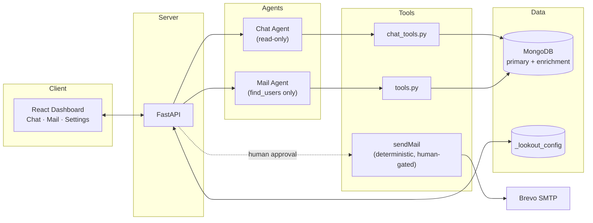
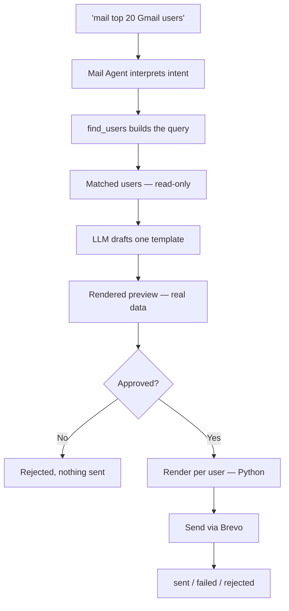
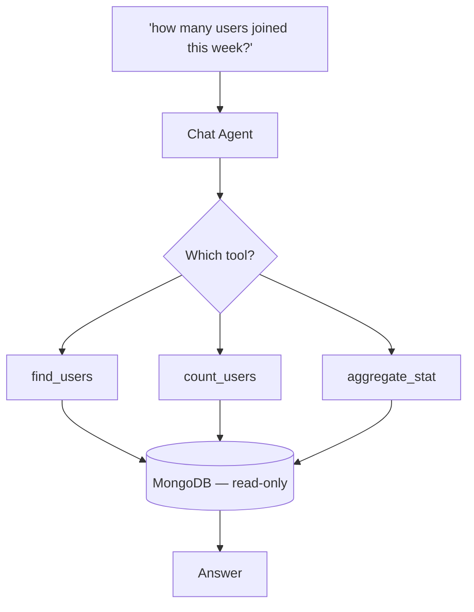

<div align="center">

# 🔭 LookOut

**Ask your database anything. Approve every email before it ships.**


[Quick Start](#quick-start) · [Architecture](#architecture) · [How It Works](#how-it-works) · [Safety Model](#safety-model)

</div>

<br/>

## Overview

LookOut connects to your MongoDB cluster, learns how your collections relate, and lets you work with your data in plain English — ask a question, or describe a campaign, and it handles the query or the draft.

No SQL. No hand-written aggregation pipelines. No copy-pasting between an LLM and your inbox.

Two modes, two different agents: one that only ever reads, and one that only ever drafts — never one model doing both.

<br/>

## Architecture

Four layers, cleanly separated: a React dashboard, a thin FastAPI layer, two agents with different tool access, and the systems they're allowed to touch.



The Chat Agent and Mail Agent are never the same process, and neither is ever handed `sendMail` directly. Sending is deterministic backend code, triggered only after a human approves.

<br/>

## How It Works

**Mail mode** — one prompt in, one template out, one human decision in the middle, then a boring, predictable render-and-send loop:



Everything left of the approval step is a single LLM call. Everything right of it is Python — no further model involvement, which is why reviewing one preview is enough to trust all of them.

**Chat mode** — same agent pattern, opposite guarantee: there's no path out of this diagram toward anything that writes or sends.



<br/>

## Safety Model

Any agent can query a database and draft an email. What matters is what it's not allowed to do.

- **Two agents, not one.** The model that answers questions and the model that drafts campaigns never share a process, let alone a toolset.
- **Ranking is math.** No model decides who's worth emailing — a plain aggregation pipeline sorts and filters, full stop.
- **You approve a real email, not a template.** The preview shows actual recipient data — never `{name}` still sitting there unrendered.
- **Guesses stay guesses until confirmed.** Auto-suggested field mappings and join keys are shown against a real sample record. Nothing saves until a human says yes.
- **Chat mode can't send anything.** Not a rule it follows — a tool it was never given.

<br/>

## Features

- **Bring your own database** — any MongoDB cluster, any schema, chosen at setup
- **Multi-collection joins** — one-to-one and one-to-many, resolved without duplicate rows
- **Live setup wizard** — auto-suggested field mapping, instant join validation against a real record
- **Hybrid config sync** — local `settings.json` plus MongoDB-backed durability
- **Scope-guarded chat** — off-topic questions get redirected back to your data, not answered

<br/>

## Quick Start

```bash
git clone https://github.com/itslokeshx/Lookout.git
cd Lookout
uv sync && source .venv/bin/activate
cp .env.example .env   # add GROQ_API_KEY, BREVO_API_KEY, MONGODB_URI
cd frontend && npm install && cd ..
```

Run it:

```bash
.venv/bin/uvicorn backend.server:app --reload --port 8000   # terminal 1
cd frontend && npm run dev                                   # terminal 2
```

Open `http://localhost:5173` — the setup wizard runs on first launch.

<br/>

## Benchmarks

Tested against a real SoulSync production dataset — 101 Gmail users, one campaign prompt.

| Metric | Result |
|---|---|
| Users matched | 101 |
| Dispatch time | 94.75s (~0.93s/email) |
| Failed sends | 0 |
| Writes during targeting | 0 |

<br/>

<details>
<summary><b>Project structure</b></summary>
<br/>

```
Lookout/
├── agent/
│   ├── core.py            # Mail agent — exposes find_users only
│   ├── chat_agent.py       # Chat agent — read-only tools + scope guardrails
│   ├── chat_tools.py       # find_users, count_users, aggregate_stat
│   ├── tools.py             # Pipeline builder + sendMail (Brevo)
│   ├── cli.py                # Terminal orchestrator
│   ├── config.py              # Environment variable loader
│   ├── config_store.py         # settings.json + MongoDB (_lookout_config) sync
│   ├── campaign/
│   │   ├── drafting.py            # Template generation, SafeDict rendering
│   │   └── models.py               # EmailTemplate, EmailDraft, DispatchedResult
│   ├── db/client.py                 # PyMongo client, collection resolution
│   └── ui/cli.py                     # Terminal styling
│
├── frontend/    # React dashboard (Vite + Tailwind v4)
├── backend/     # FastAPI REST layer
├── settings.json
├── pyproject.toml
└── .env
```

</details>

<details>
<summary><b>Codebase reference</b></summary>
<br/>

**`agent/core.py`** — Builds the Mail agent on Groq via LangChain. Exposes exactly one tool, `find_users`, which queries matched users, safely serializes MongoDB documents, and caches results for the rest of the campaign flow.

**`agent/chat_agent.py`** — The conversational analyst. Read-only tools only, plus scope guardrails that keep responses database-centric and redirect off-topic questions.

**`agent/chat_tools.py`** — `chat_find_users`, `count_users`, `aggregate_stat`, `find_secondary_documents`, `count_secondary_documents`.

**`agent/tools.py`** — The aggregation pipeline builder behind `find_users`, the `sendMail` Brevo dispatcher, and an in-memory query cache shared across the wizard's steps.

**`agent/config_store.py`** — Hybrid persistence: writes to `settings.json`, syncs to `_lookout_config` in MongoDB, loads from either on startup. Also runs connection tests, join checks, and heuristic field-mapping suggestions.

**`agent/campaign/drafting.py`** — Wraps generated copy in an HTML shell and applies `SafeDict` substitution, so a missing field renders as literal placeholder text instead of raising an error.

**`agent/campaign/models.py`** — Pydantic v2: `EmailTemplate`, `EmailDraft`, `DispatchedResult`.

**`backend/server.py`** — FastAPI bridge:

| Endpoint | Purpose |
|---|---|
| `/api/settings` | Save / fetch configuration |
| `/api/databases`, `/api/collections/{db}` | Discover databases and collections |
| `/api/check-join` | Validate a primary/secondary key relationship |
| `/api/suggest-mapping` | Heuristic field-mapping suggestions |
| `/api/chat` | Message the Chat Agent |
| `/api/campaign/target` \| `/draft` \| `/dispatch` | Targeting, drafting, and dispatch steps |

**`frontend/src/App.jsx`** — View switching (setup vs. workspace), mode switching (Chat / Mail / Settings), theme persistence.

**`frontend/src/components/SetupView.jsx`** — Stepped onboarding with live schema preview.

**`frontend/src/components/ChatView.jsx`** / **`MailView.jsx`** — The two mode interfaces.

</details>

<details>
<summary><b>Database join strategy</b></summary>
<br/>

Plain `$lookup` + `$unwind` duplicates a user's row once per matching secondary document — a real problem the moment a relationship is one-to-many. LookOut uses a correlated sub-pipeline that sorts and limits *inside* the lookup, resolving to exactly one enrichment record per user before it reaches the result set:

```python
lookup_pipeline = [
    {"$match": {"$expr": {"$eq": [f"${foreign_key}", "$$local_val"]}}}
]
if sort_field:
    sort_dir = -1 if not sort_ascending else 1
    lookup_pipeline.append({"$sort": {sort_field: sort_dir}})
lookup_pipeline.append({"$limit": 1})  # collapses one-to-many into one record

pipeline.append({
    "$lookup": {
        "from": secondary_collection,
        "let": {"local_val": f"${local_key}"},
        "pipeline": lookup_pipeline,
        "as": "_enrichment_docs"
    }
})
```

No duplicate rows, no silent data loss — the sort/limit behavior is explicit and configurable per relationship, not an accidental side effect of how Mongo expands an array.

</details>

<details>
<summary><b>Setup wizard walkthrough</b></summary>
<br/>

**1. Database & join configuration** — pick one collection or two. For two, map the local key (usually `_id`) to the foreign key, then run **Check Relationship Validation** — LookOut queries a real sample record and reports exactly how many matches it found.

**2. Field mapping** — map email/name (or click **Auto-suggest**), optionally join-date and last-active, and any numeric metrics worth aggregating. A live schema preview shows the exact JSON structure being queried as you go.

**3. Sender configuration** — set the name and address recipients see. Saving syncs to both `settings.json` and `_lookout_config`.

</details>

<details>
<summary><b>Why I built this</b></summary>
<br/>

I wanted to thank SoulSync's most engaged listeners. The actual process: export users from MongoDB, paste them into an LLM and ask for the top listeners, ask for a personalized email per person, then copy each draft into my email service by hand.

The campaign worked. The workflow didn't. I wasn't making decisions anymore — I was just the wire between three systems that each already knew their job: the database had the users, the LLM knew how to write, the email service knew how to send. The only slow part was me, passing data between them by hand.

That's LookOut: one prompt, instead of four tools and a lot of copy-pasting.

</details>

<br/>

## Contributing

```bash
git checkout -b feature/amazing-feature
git commit -m "Add some amazing feature"
git push origin feature/amazing-feature
```

Open a pull request, or file an issue if something's broken.

## License

MIT — see [LICENSE](./LICENSE).